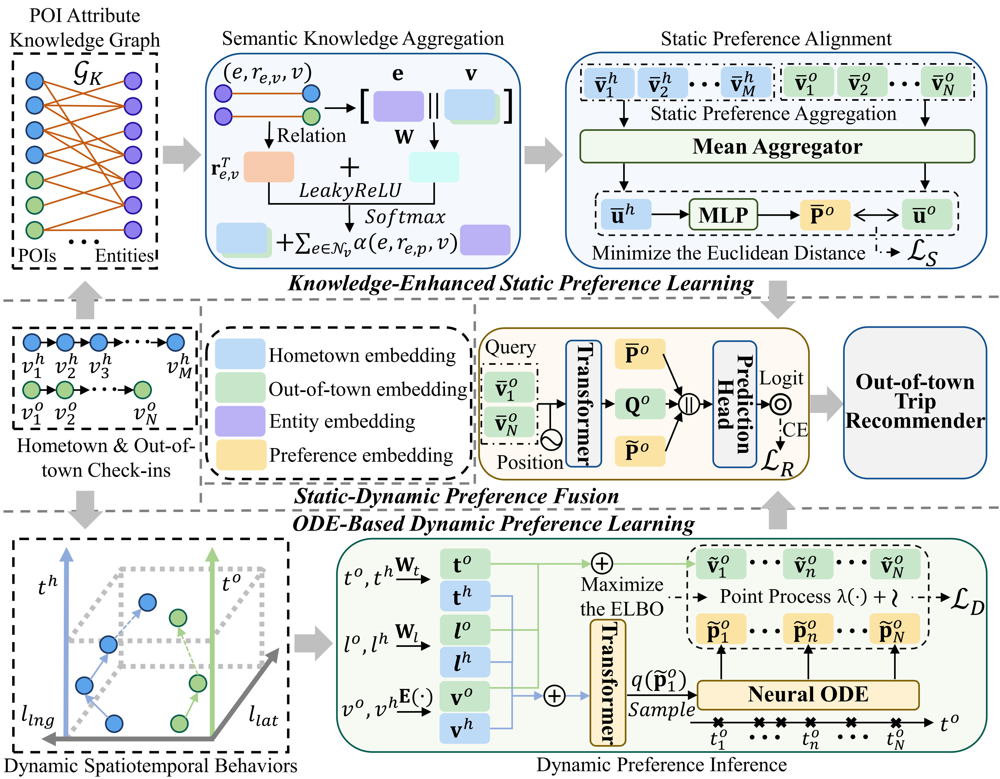

# (NeurIPS'25) [SPOT-Trip: Dual-Preference Driven Out-of-Town Trip Recommendation](https://arxiv.org/abs/2506.01705)

<p align="center">
  
</p>

> If you find our work useful in your research, please consider giving a star ⭐ and citing 📖 our paper:

```bibtex
@inproceedings{liu2025spottrip,
  title={{SPOT-Trip: Dual-Preference Driven Out-of-Town Trip Recommendation}},
  author={Yinghui Liu and Hao Miao and Guojiang Shen and Yan Zhao and Xiangjie Kong and Ivan Lee},
  booktitle={{NeurIPS}},
  year={2025}
}
```

## Dataset

We have released the travel behavior dataset Foursquare and Yelp which are generated based on the [Foursquare](https://sites.google.com/site/yangdingqi/home/foursquaredataset) and [Yelp](https://www.yelp.com.tw/dataset) dataset. You can run the model with these out-of-town data provided in the respective folder.

## Train and Evaluate

Simply run the following command to train and evaluate:
```cmd
cd ./code
python main.py --ori_data {...} --dst_data {...} --trans_data {...} --save_path {...} --model SPOT-Trip --mode train --kg --train_trans --ode --s_infer
```
## Contact Us
For inquiries or further assistance, contact us at LiuYingHui240@outlook.com.
